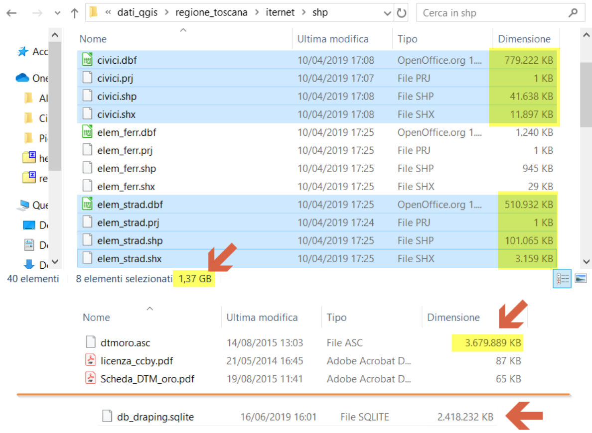

# Draping SpatiaLite 5.0

**Drappeggio delle geometrie su griglie raster DEM/DTM  o Come trasformare le geometrie 2D in 3D**

Traduzione del [Wiki](https://www.gaia-gis.it/fossil/librasterlite2/wiki?name=draping)

---

<!-- TOC -->

- [Draping SpatiaLite 5.0](#draping-spatialite-50)
  - [Una rapida introduzione](#una-rapida-introduzione)
    - [POINT](#point)
    - [LINESTRING o POLYGON](#linestring-o-polygon)
  - [Esempio pratico](#esempio-pratico)
    - [creazione e popolamento del database di lavoro](#creazione-e-popolamento-del-database-di-lavoro)
      - [civici](#civici)
      - [rete stradale](#rete-stradale)
      - [copertura raster DTM](#copertura-raster-dtm)
      - [Importare DTM](#importare-dtm)
    - [trasformare un set di dati 2D in uno 3D](#trasformare-un-set-di-dati-2d-in-uno-3d)
  - [Un secondo esempio più avanzato](#un-secondo-esempio-pi%C3%B9-avanzato)
    - [Come utilizzare più Raster Coverage per Drappeggio di Geometrie](#come-utilizzare-pi%C3%B9-raster-coverage-per-drappeggio-di-geometrie)
  - [Note tecniche](#note-tecniche)
    - [come funziona RL2_DrapeGeometries() internamente](#come-funziona-rl2drapegeometries-internamente)
    - [mantenimento dei valori M](#mantenimento-dei-valori-m)

<!-- /TOC -->

## Una rapida introduzione

### POINT

Estrapolando un valore di elevazione (ovvero coordinata Z) è semplice nel caso di POINT Geometries. 

Dobbiamo semplicemente identificare con precisione quale cella specifica della griglia raster è sovrapposta al punto. 
La coordinata Z da impostare nel punto è il valore di elevazione assegnato a questa cella. 

Quindi, nell'esempio mostrato dalla figura di sotto, **Z = 121.88** sarà impostato per il Punto **Pt**.

<p align="center"> <a href="https://www.gaia-gis.it/fossil/librasterlite2/wiki?name=draping" target="_blank"></a>
</p>

### LINESTRING o POLYGON

Le cose infelice diventano un po' più difficili nel caso delle geometrie LINESTRING o POLYGON. 

In entrambi i casi possiamo ancora continuare ad adottare lo stesso approccio adottato per POINT; ci viene solo richiesto di eseguire un loop iterativo su ciascun vertice. 
Ma in questo modo, come esemplificato dalla figura di sotto, otterremo un segmento retto che collega **V1** a **V0** che attraversa molte celle nella griglia raster. 

Se semplicemente ignoreremo tutte queste celle, rischieremo di introdurre una sorta di soppressione delle informazioni. 
Questo può facilmente causare un degrado indesiderato nella precisione delle inter-cordate Z-coords, e questo sicuramente non è una buona cosa.

<p align="center"> <a href="https://www.gaia-gis.it/fossil/librasterlite2/wiki?name=draping" target="_blank"></a>
</p>

Solo per capire meglio il problema:
* Se consideriamo solo un segmento rettilineo **V1-V2**, assumeremo erroneamente che il profilo altimetrico abbia una pendenza costante. 
(come mostrato dal caso a) nella figura sotto)
* Ma il profilo altimetrico effettivo della superficie sottostante potrebbe essere completamente diverso e molto più articolato. 
(come dimostrato da casi b) e c) sulla figura sotto)
* **Conclusione**: abbiamo sicuramente bisogno di un approccio più sofisticato quando drappeggiate LINESTRING e POLYGON. 
Si garantisce in modo sicuro di essere assolutamente sicuri di non sopprimere mai qualsiasi informazione pertinente sulle quote disponibili dalla griglia raster.

<p align="center"> <a href="https://www.gaia-gis.it/fossil/librasterlite2/wiki?name=draping" target="_blank"></a>
</p>

La soluzione è piuttosto semplice:
* Abbiamo solo bisogno di approfondire ulteriormente le nostre Geometrie LINESTRING o POLYGON interpolando più Vertici a intervalli regolari. 
In altre parole, dobbiamo sempre chiamare **ST_Segmentize ()** prima di drappeggiare le nostre geometrie sulla griglia DEM/DTM.
* Questi **vertici interpolati** dovrebbero idealmente assicurare che ogni cella pertinente sulla griglia raster sia effettivamente sovrapposta. 
Con il teorema di [campionamento di **Shannon**](https://en.wikipedia.org/wiki/Nyquist%E2%80%93Shannon_sampling_theorem) il limite di lunghezza ottimale da passare a **ST_Segmentize ()** è la **metà della dimensione della cella**.

**avvertimento**

* Enormi geometrie che presentano un numero molto elevato di vertici sono in genere molto lenti per essere valutati da funzioni SQL come **ST_Intersects**, ecc.
* Quindi dobbiamo necessariamente **semplificare** tutte le geometrie drappeggiate nelle fasi di post-elaborazione. 
Questo è un approccio classico in due fasi:
    * Prima di tutto inizieremo sempre **addensando** opportunamente tutte le Geometrie prima di drappeggiarle.
    * Una volta eseguito il drappeggio, dobbiamo **semplificare** per rendere le nostre Geometrie il più snelle possibili:
        * Verranno preservati solo i vertici interpolati più rilevanti; cioè quelli corrispondenti ad alcune variazioni rilevanti in elevazione.
        * Qualsiasi altro vertice interpolato verrà semplicemente scartato, perché non è veramente utile.
    * È un compromesso ragionevole ed efficace: le nostre Geometrie drappeggiate metteranno sicuramente un po' di peso in più. 
    Ma non più di ciò che è strettamente indispensabile per evitare qualsiasi seria perdita di informazioni e un'accuratezza degradata.

<p align="center"> <a href="https://www.gaia-gis.it/fossil/librasterlite2/wiki?name=draping" target="_blank"></a>
</p>

## Esempio pratico

In questo primo esempio useremo i seguenti set di dati:
1. _civici.shp_: questo è un primo Shapefile contenente più di 1,5 milioni di Punti (numeri civici in Toscana).
2. _elem_strad.shp_: questo è un altro Shapefile contenente più di 400.000 Linestrings (Tuscany Roads).
3. _dtmoro.asc_: una [griglia ASCII](https://en.wikipedia.org/wiki/Esri_grid) contenente un [DTM (Digital Terrain Model)](https://en.wikipedia.org/wiki/Digital_elevation_model) che copre tutta la Toscana con una risoluzione cellulare di **10m x 10m**.

Tutti e tre i dataset sono disponibili per il download gratuito da qui: [Regione Toscana - SITA: Cartoteca](http://www502.regione.toscana.it/geoscopio/cartoteca.html):

<p align="center"> <a href="http://www502.regione.toscana.it/geoscopio/cartoteca.html" target="_blank"></a>
</p>

**Suggerimento**: troverai sia civici.shp che elem_strad.shp all'interno del pacchetto **Grafo Stradale** (Road Networ). 
dtmoro.asc è contenuto nel pacchetto denominato **Morfologia / DTM 10x10 Orografico** (Morfologia / 10x10 DTM orografico).

### creazione e popolamento del database di lavoro

#### civici

Prima di tutto creeremo e popoleremo la tabella **civici** importando il corrispondente Shapefile ( numeri civici ). 
Assicurati di impostare **SRID = 3003** e verificare l'opzione **With SpatialIndex (R*Tree)**.

Come mostrato nella figura sotto, useremo la procedura guidata della GUI appropriata per svolgere questa attività, ma se lo desideri, alla fine potresti adottare un approccio SQL puro eseguendo la seguente dichiarazione:

```sql
SELECT ImportSHP('D:\dati_qgis\regione_toscana\iternet\shp\civici', 
       'civici','CP1252',3003,'Geometry','PK_UID','POINT',0,0,1,1,'LOWERCASE');
```
<p align="center"> <a href="https://www.gaia-gis.it/fossil/librasterlite2/wiki?name=draping" target="_blank"></a>
</p>

dopo circa **9 minuti**:

<p align="center"> <a href="https://www.gaia-gis.it/fossil/librasterlite2/wiki?name=draping" target="_blank"></a>
</p>


#### rete stradale

Quindi creeremo e popoleremo la tabella **elem_civ** importando il corrispondente Shapefile (rete stradale). 
Assicurati di impostare **SRID = 3003** e per verificare **With SpatialIndex (R*Tree)**. 

Come mostrato nella figura sotto, useremo la procedura guidata della GUI appropriata per svolgere questa attività, ma se lo desideri, alla fine potresti adottare un approccio SQL puro eseguendo la seguente dichiarazione:

```sql
SELECT ImportSHP( 'D:\dati_qgis\regione_toscana\iternet\shp\elem_strad',
       'elem_strad','CP1252',3003,'Geometry','PK_UID','LINESTRING',0,0,1,1,'LOWERCASE');
```

<p align="center"> <a href="https://www.gaia-gis.it/fossil/librasterlite2/wiki?name=draping" target="_blank"></a>
</p>

dopo circa **4 minuti**:

<p align="center"> <a href="https://www.gaia-gis.it/fossil/librasterlite2/wiki?name=draping" target="_blank"></a>
</p>

#### copertura raster DTM

Ora creeremo una copertura raster vuota denominata **dtmoro**. 

Come mostrato nella figura sotto, useremo la procedura guidata della GUI appropriata per svolgere questa attività, ma se lo desideri, alla fine potresti adottare un approccio SQL puro eseguendo la seguente dichiarazione:

```sql
SELECT RL2_CreateRasterCoverage ('dtmoro','FLOAT','DATAGRID',1,'LZMA',100,512,512,3003,10.0,10.0, 
       RL2_SetPixelValue (RL2_CreatePixel ('FLOAT','DATAGRID',1),0,-9999 ),1,0,1,1,1,1);
```

<p align="center"> <a href="https://www.gaia-gis.it/fossil/librasterlite2/wiki?name=draping" target="_blank"></a>
</p>

<p align="center"> <a href="https://www.gaia-gis.it/fossil/librasterlite2/wiki?name=draping" target="_blank"></a>
</p>

quindi:

<p align="center"> <a href="https://www.gaia-gis.it/fossil/librasterlite2/wiki?name=draping" target="_blank"></a>
</p>

#### Importare DTM

Infine, caricaremo DTM **dtmoro.asc** nella copertura raster creata nel passaggio precedente. 

Come mostrato nella figura sotto, useremo la procedura guidata della GUI appropriata per svolgere questa attività, ma se lo desideri, alla fine potresti adottare un approccio SQL puro eseguendo la seguente dichiarazione:

```sql
SELECT RL2_SetMaxThreads(8); -- per usare fino ad un massimo di 8 threads in parallelo durante la compressione
SELECT RL2_LoadRaster ('dtmoro','D:\dati_qgis\regione_toscana\DTM_Orografico\dtmoro.asc',0,3003,1,1);
```

**NB.:** 

per autorizzare **RL2** ad usare fino ad un massimo di **8 threads in parallelo** durante la compressione, e quindi comprimerà' **8 tiles alla volta**, con ovvio beneficio sui tempi totali di importazione. ;-)
In generale non e' necessario chiedere 8 threads, va bene qualsiasi valore, ma di norma le moderne CPU hanno proprio 8 cores tra fisici e virtuali. La regola da usare è: se hai 8 cores la velocita' piu' alta si ottiene attivando tra i 12 ed i 16 threads; insomma, il doppio dei cores o poco meno.

<p align="center"> <a href="" target="_blank"></a>
</p>

**Avviso importante per gli utenti Windows**

L'importazione di una griglia ASCII richiede necessariamente l'apertura di un file temporaneo di supporto. 
Sfortunatamente tutte le versioni recenti di Windows pensano che i file temporanei siano oggetti pericolosi che generano un serio allarme di sicurezza che causa una condizione di errore irreversibile. 

C'è solo un modo per caricare in modo efficace una griglia ASCII su Windows: l'applicazione (spatialite) deve necessariamente essere **eseguita con i privilegi di amministratore**.

<p align="center"> <a href="" target="_blank"></a>
</p>

<p align="center"> <a href="" target="_blank"></a>
</p>

tempo di esecuzione per importare il DTM circa **31** minuti


<p align="center"> <a href="" target="_blank"></a>
</p>

**quadro sinottico**

il file sqlite pesa circa **2,5 GB** (compreso di elaborazioni di draping) contro i circa **5 GB** dei file singoli.

<p align="center"> <a href="https://www.gaia-gis.it/fossil/librasterlite2/wiki?name=draping" target="_blank"></a>
</p>

### trasformare un set di dati 2D in uno 3D

**Bene**, ora siamo finalmente pronti per trasformare sia i dataset **civici** che **elem_strad** dal **2D** al **3D**. Questa attività richiede solo l'esecuzione di una singola istruzione **SQL**:

- **civici**:

```sql
SELECT RL2_DrapeGeometries(NULL,'dtmoro',NULL,'civici','geometry','geom3d',-9999,5.0,5.0,0);
-------------------------------------
1
```
<p align="center"> <a href="https://www.gaia-gis.it/fossil/librasterlite2/wiki?name=draping" target="_blank"></a>
</p>

**Check geometries**:

<p align="center"> <a href="https://www.gaia-gis.it/fossil/librasterlite2/wiki?name=draping" target="_blank"></a>
</p>

- **elementi stradali**:

```sql
SELECT RL2_DrapeGeometries(NULL,'dtmoro',NULL,'elem_strad','geometry','geom3d',-9999,5.0,5.0,0);
-------------------------------------
1
```
<p align="center"> <a href="https://www.gaia-gis.it/fossil/librasterlite2/wiki?name=draping" target="_blank"></a>
</p>

**Check geometries**:

<p align="center"> <a href="https://www.gaia-gis.it/fossil/librasterlite2/wiki?name=draping" target="_blank"></a>
</p>


**Una rapida spiegazione:**
1. il primo argomento è il **prefisso DB** del database allegato contenente la copertura raster DEM/DTM. Quando è `NULL` (come in questo caso), si presuppone sempre il database **MAIN** .
2. il secondo argomento è il **nome della copertura raster**. Si noti che solo le coperture raster del tipo **DATAGRID** possono essere accettate.
3. il terzo argomento ... lo ignoreremo per ora; sarà spiegato nel secondo esempio avanzato.
4. il quarto argomento è il **nome della tabella spaziale** contenente le geometrie da drappeggiare, che si presume sempre nel database **MAIN**. **Nota** : sia la copertura raster DTM / DEM che la tabella spaziale devono condividere lo stesso valore **SRID**.
5. il quinto argomento è il **nome della colonna della geometria 2D** da drappeggiare.
6. il sesto argomento è il **nome della colonna 3D Geometry** in cui verrà archiviato il risultato del drappeggio. **Nota**: questa colonna non deve esistere e verrà creata automaticamente da **ST_DrapeGeometries ()** stesso.
7. il settimo argomento è il valore **NO-DATA** da assegnare come valore di coordinata Z a tutti i Punti/Vertici di elevazione sconosciuta. **Nota**: in questo caso abbiamo utilizzato **-9999** , ovvero lo stesso valore **NoData** che abbiamo usato durante la creazione della copertura raster, ma sei libero di scegliere qualsiasi altro valore diverso. Non esiste alcuna relazione tra il valore NoData di DataGrid e il valore NoData di Z-coords.
8.  l'ottavo argomento è la **distanza di densificazione**.
9.  il nono argomento è la **distanza di semplificazione**. Abbiamo già discusso la portata di entrambe le distanze nell'introduzione; in questo caso li imposteremo in base alla regola di Shannon (metà della risoluzione della cella). Il DTM ha una risoluzione della cella di 10,0 m e di conseguenza l'impostazione della densità e delle distanze di semplificazione a 5,0 m è sicuramente appropriata.
10.  ignoreremo per ora il decimo argomento; sarà esaminato nella nota tecnica in fondo a questa pagina Wiki.

Tutto fatto; i tuoi dataset 2D sono stati trasformati in set di dati 3D. Solo un ultimo controllo rapido testando caratteristiche casuali.

<p align="center"> <a href="https://www.gaia-gis.it/fossil/librasterlite2/wiki?name=draping" target="_blank"></a>
</p>

## Un secondo esempio più avanzato

Nel primo esempio abbiamo visto che la Toscana ha un **DTM** a media risoluzione (10mx10m) che copre l'intera superficie della Regione.

<p align="center"> <a href="https://www.gaia-gis.it/fossil/librasterlite2/wiki?name=draping" target="_blank"></a>
</p>

Ma su molte aree specifiche (mostrate nella figura di sopra dalle griglie rosse e verdi) la Toscana ha un secondo tipo di **DTM/DSM** basato su [rilievi](https://en.wikipedia.org/wiki/Lidar) **Lidar** ad **alta risoluzione (1mx1m)**. Tali Lidar DTM/DSM non coprono l'intera Regione, ma dove sono disponibili, sono certamente fonte di dati di elevazione molto preziosi.Il DTM/DSM Lidar appartiene a due serie diverse (verde e rossa), e sono di età e accuratezza diverse.

Il miglior approccio possibile per drappeggiare le geometrie sarà ovviamente quello che assicurerà che in ogni caso verranno utilizzati i dati di elevazione più recenti e accurati, così da ottenere risultati ottimali. 
**RL2_DrapeGeometries ()** ha la capacità di supportare uno scenario così complesso, vediamo come è possibile.

### Come utilizzare più Raster Coverage per Drappeggio di Geometrie

1. In questo secondo esempio useremo ancora una volta gli stessi dataset 2D **civici** ed **elem_strad** che abbiamo già utilizzato nell'esempio precedente. 
E continueremo a utilizzare come prima il **dtmoro 10x10** in modo da avere un DTM omogeneo che copra l'intera regione senza spazi **vuoti**.
2. Ma questa volta creeremo più **Raster Coverage** contenenti tutto il **DTM/DSM Lidar 1x1m** disponibili. 
Ci sono molti modi possibili per farlo, ma un buon approccio sarebbe quello di creare una copertura raster diversa per ogni serie e anno. 
ad es. **lidar_red_2008**, **lidar_red_2009**, **lidar_green_2010**, **lidar_green_2011** e così via.
3. Ora dobbiamo definire un ordine di priorità appropriato in modo da essere sicuri che Draping elaborerà tutte le coperture raster nella sequenza richiesta.
   * Le coperture Lidar più recenti e accurate dovrebbero essere elaborate con la massima priorità;
   * Quindi la copertura Lidar meno recente e accurata dovrebbe essere elaborata in ordine decrescente di priorità;
   * Infine, la risoluzione media 10x10 dtmoro dovrebbe essere elaborata come ultima scelta per riempire qualsiasi spazio rimanente scoperto da Lidar DTM/DSM.
4. Definire l'ordine di priorità è piuttosto banale. Devi solo creare una tabella di supporto come questa:
```sql
CREATE TEMPORARY TABLE draping_aux (
    progr INTEGER NOT NULL,
    db_prefix TEXT,
    coverage_name TEXT NOT NULL);
```
* il nome della tabella helper non è rilevante, ma i nomi delle colonne devono essere esattamente come mostrato nell'esempio precedente.
* **progr** è l'indice di priorità relativa (più basso è il valore, più alta è la priorità).
* **db_prefix** è il prefisso del DB allegato contenente la copertura raster. Quando è **NULL**, il DB MAIN sarà sottinteso.
* **coverage_name** è il nome di una copertura raster da elaborare per Drapping Geometries.
```sql
--
-- inserting all Lidar Raster Coverages in decreasing priority order
--
...
INSERT INTO draping_aux ( coverage_name , progr ) VALUES ( 'lidar_green_2011' , 10 );
INSERT INTO draping_aux ( coverage_name , progr ) VALUES ( 'lidar_green_2010' , 11 );
INSERT INTO draping_aux ( coverage_name , progr ) VALUES ( 'lidar_red_2009' , 12 );
INSERT INTO draping_aux ( coverage_name , progr ) VALUES ( 'lidar_red_2008' , 13 );
...

--
-- inserting the 10x10 dtmoro Raster Coverage with lowest priority
--
INSERT INTO draping_aux ( coverage_name , progr ) VALUES ( 'dtmoro' , 99 );
```
Ora siamo pronti per popolare la tabella helper inserendo qualsiasi Copertura raster richiesta specificandone la relativa priorità.

5. Siamo finalmente pronti per drappeggiare le geometrie su più Raster Coverages:

```sql
SELECT RL2_DrapeGeometries (NULL, NULL, 'draping_aux', 'civici', 'geometry', 'geom3d', -9999, 5.0, 5.0, 0); 
--------------------------------------- 
1 
```

```sql
SELECT RL2_DrapeGeometries (NULL, NULL, 'draping_aux' , "elem_strad", "geometry", "geom3d", -9999, 5.0, 5.0, 0); 
--------------------------------------- 
1
```

Queste sono quasi le stesse chiamate a **RL2_DrapeGeometries ()** che abbiamo fatto nel primo esempio, ad eccezione di due dettagli:
* il secondo argomento ( Raster Coverage name ) ora è **NULL**, poiché ora stiamo elaborando più Raster Coverages.
* il terzo argomento (che in precedenza era NULL ) ora specifica il nome della tabella helper contenente l'elenco di tutte le Raster Coverage da elaborare nell'ordine di priorità specificato. **Nota**: questi due argomenti si escludono a vicenda: è possibile definire l'uno o l'altro, ma non entrambi allo stesso tempo. E devi specificare uno di loro.

**Suggerimento utile**

Per verificare l'ordine di priorità in cui le Raster Coverage saranno elaborate da **RL2_DrapeGeometries** devi solo eseguire la seguente query SQL:

```sql
SELECT db_prefix, coverage_name
FROM draping_aux
ORDER BY progr;
```

## Note tecniche

### come funziona RL2_DrapeGeometries() internamente

1. **RL2_DrapeGeometries ()** inizierà sempre creando la colonna della geometria 3D.
2. quindi popolerà inizialmente la colonna della geometria 3D inserendo tutte le geometrie presenti nella colonna della geometria 2D:
   * tutte le coordinate **X** e **Y** (e eventualmente **M** ) verranno mantenute così come sono.
   * tutte le coordinate **Z** saranno inizialmente impostate sul valore **NO-DATA**.
   * se è stata specificata una **distanza di densificazione**, tutti i vertici necessari saranno interpolati in ciascuna geometria 3D.
3. ora **RL2_DrapeGeometry ()** inizierà ad elaborare la prima copertura raster (o quella unica se è stata specificata una copertura raster singola).
4. la copertura raster verrà elaborata estraendo una singola tessera in ogni momento. 
Verranno elaborate tutte le geometrie che intersecano il riquadro corrente (e questo spiega perché la tabella spaziale deve essere supportata da un indice spaziale). 
Tutti i punti/vertici che intersecano la tessera e presentano ancora valori di **NO-DATI** assumeranno il valore di elevazione preso dalle celle corrispondenti della tessera. 
Qualsiasi punto/vertice che presenta un valore **Z** diverso da **NO-DATA** non cambierà mai in una seconda volta, e questo spiega perché la priorità di esecuzione di ciascuna Copertura Raster è di fondamentale importanza.
5. quando tutte le tessere della copertura raster corrente saranno finalmente elaborate, verrà elaborata la successiva copertura raster (se presente). 
Il ciclo riprenderà dal punto 3) fino a consumare tutte le coperture raster.
6. il passo finale sarà quello di semplificare tutte le geometrie 3D in base alla distanza di semplificazione indicata.

###  mantenimento dei valori M

**Nota**: alla fine è possibile utilizzare **RL2_DrapeGeometries ()** in modo da impostare valori **M** invece dei valori **Z** . 

**Richiamo rapido:** per definizione i valori **M** sono destinati a supportare qualsiasi tipo possibile di misure generiche. Questa è esattamente la stessa definizione adottata dai **DataGrid** generici. 
Quindi **RL2_DrapeGeometries ()** può essere legittimamente chiamato per interpolare i valori **M** invece dei valori **Z** ogni volta che penserai che potrebbe essere utile.

**Solo pochi esempi pratici:** pensate ad alcuni **DataGrid** che contengono la **temperatura** o l'**intensità della pioggia** o la **velocità** del **vento** o l'**intensità del rumore** o le misure della **densità di popolazione**. 
In tutti questi casi potresti probabilmente trovare utile interpolare misure come i valori **M** memorizzati direttamente nelle tue Geometrie.

```sql
SELECT RL2_DrapeGeometries( NULL , 'dtmoro' , NULL , 'civici' , 'geometry' , 'geom3d' , -9999 , 5.0 , 5.0 , 1 );
---------------------------------------
1
```
* il decimo e ultimo argomento accettato da** RL2_DrapeGeometries ()** è **update_m** , ed è del tipo **booleano**:
    * se impostato su **FALSE** (questa è l'impostazione predefinita), solo i valori **Z** saranno influenzati da Drappeggio, e tutti i valori **M** saranno preservati intatti.
    * se impostato su **TRUE**, solo i valori **M** saranno influenzati da Drappeggio e tutti i valori **Z** saranno mantenuti intatti.

---
Resta in contatto ... unisciti alla community, iscriviti alla [mailing list](http://groups.google.com/group/spatialite-users) degli utenti di SpatiaLite
SpatiaLite è sviluppato e gestito da Alessandro Furieri [a.furieri@lqt.it](a.furieri@lqt.it)
Fossil versione 2.0 [1d407cff32] 2017-03-03 12:00:30